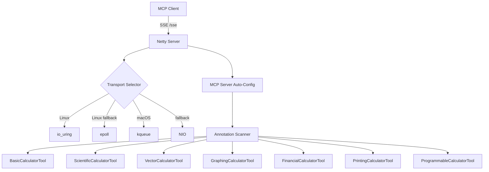

# Math Calculator — Spring AI MCP Server

A Spring Boot MCP (Model Context Protocol) server that exposes a math calculator via Spring AI. AI clients (Claude Desktop, Claude Code, Cursor, MCP Inspector) invoke calculator operations as MCP tools over SSE transport.

## Technology Stack

| Component    | Version   | Notes                                              |
|--------------|-----------|----------------------------------------------------|
| Java         | 25        | Virtual threads, StructuredTaskScope, ScopedValue  |
| Spring Boot  | 4.0.3     | Released Feb 2026                                  |
| Spring AI    | 2.0.0-M2  | Milestone for Boot 4                               |
| Gradle       | Kotlin DSL| `build.gradle.kts`                                 |
| Server       | Netty     | WebFlux — io_uring/epoll/kqueue transport          |
| Transport    | SSE       | `spring-ai-starter-mcp-server-webflux`             |

## Build & Run

```bash
# Build
./gradlew build

# Run (port 44321)
./gradlew bootRun

# Tests only
./gradlew test
```

## MCP Tools Reference

### Basic Calculator (BigDecimal precision)

| Tool       | Params              | Description                       |
|------------|---------------------|-----------------------------------|
| `add`      | `a`, `b`            | Add two numbers                   |
| `subtract` | `a`, `b`            | Subtract b from a                 |
| `multiply` | `a`, `b`            | Multiply two numbers              |
| `divide`   | `a`, `b`            | Divide a by b (scale 20)          |
| `power`    | `base`, `exponent`  | Raise base to integer exponent    |
| `modulo`   | `a`, `b`            | Remainder of a / b                |
| `abs`      | `a`                 | Absolute value                    |

### Scientific Calculator (StrictMath)

| Tool        | Params    | Description                            |
|-------------|-----------|----------------------------------------|
| `sqrt`      | `number`  | Square root (non-negative)             |
| `log`       | `number`  | Natural logarithm (positive)           |
| `log10`     | `number`  | Base-10 logarithm (positive)           |
| `factorial` | `n`       | Factorial (0-20)                       |
| `sin`       | `degrees` | Sine (degrees)                         |
| `cos`       | `degrees` | Cosine (degrees)                       |
| `tan`       | `degrees` | Tangent (degrees)                      |

### Vector Calculator (SIMD — Java Vector API)

| Tool             | Params                  | Description                   |
|------------------|-------------------------|-------------------------------|
| `sumArray`       | `numbers`               | Sum all elements              |
| `dotProduct`     | `a`, `b`                | Dot product of two arrays     |
| `scaleArray`     | `numbers`, `scalar`     | Scale all elements by scalar  |
| `magnitudeArray` | `numbers`               | Euclidean norm                |

### Graphing Calculator (Expression Engine)

| Tool            | Params                                          | Description                    |
|-----------------|------------------------------------------------|--------------------------------|
| `plotFunction`  | `expression`, `variable`, `min`, `max`, `steps`| Generate {x,y} plot points     |
| `solveEquation` | `expression`, `variable`, `initialGuess`       | Newton-Raphson root finding    |
| `findRoots`     | `expression`, `variable`, `min`, `max`         | Find all roots in interval     |

### Financial Calculator (BigDecimal precision)

| Tool                   | Params                                         | Description                    |
|------------------------|-------------------------------------------------|-------------------------------|
| `compoundInterest`     | `principal`, `annualRate`, `years`, `compoundsPerYear` | Compound interest        |
| `loanPayment`          | `principal`, `annualRate`, `years`              | Monthly loan payment           |
| `presentValue`         | `futureValue`, `annualRate`, `years`            | Present value                  |
| `futureValueAnnuity`   | `payment`, `annualRate`, `years`                | Future value of annuity        |
| `returnOnInvestment`   | `gain`, `cost`                                  | ROI as percentage              |
| `amortizationSchedule` | `principal`, `annualRate`, `years`              | Monthly amortization schedule  |

### Printing Calculator (Tape/Audit Trail)

| Tool               | Params       | Description                              |
|--------------------|-------------|------------------------------------------|
| `calculateWithTape`| `operations`| Process ops (+,-,*,/,=,C,T) with tape   |

### Programmable Calculator (Expression Engine)

| Tool                    | Params                      | Description                    |
|-------------------------|-----------------------------|--------------------------------|
| `evaluate`              | `expression`                | Evaluate math expression       |
| `evaluateWithVariables` | `expression`, `variables`   | Evaluate with variable map     |

## Integration

### Claude Code

Add to your MCP configuration:

```json
{
  "mcpServers": {
    "math-calculator": {
      "url": "http://localhost:44321/sse"
    }
  }
}
```

### MCP Inspector

```bash
pnpm dlx @modelcontextprotocol/inspector
```

Connect to `http://localhost:44321/sse`.

## Design Principles

- **Precision**: `BigDecimal` for exact basic/financial arithmetic, `StrictMath` for reproducible scientific functions
- **SIMD**: Java 25 Vector API (`jdk.incubator.vector`) for hardware-accelerated batch array operations
- **Transport**: Netty with io_uring (Linux), epoll, kqueue (macOS), NIO fallback
- **Virtual threads**: `spring.threads.virtual.enabled=true` for lightweight concurrency

## Architecture


