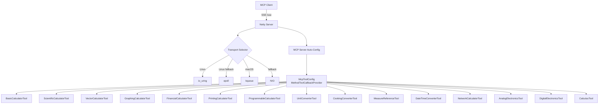

# Math Calculator — Spring AI MCP Server

A Spring Boot MCP (Model Context Protocol) server that exposes a math calculator via Spring AI. AI clients (Claude Desktop, Claude Code, Cursor, MCP Inspector) invoke calculator operations as MCP tools over SSE transport.

**Repository**: [https://github.com/farchanjo/math-calculator](https://github.com/farchanjo/math-calculator)

## Technology Stack

| Component    | Version   | Notes                                              |
|--------------|-----------|----------------------------------------------------|
| Java         | 25        | Virtual threads enabled                            |
| Spring Boot  | 4.0.3     | Released Feb 2026                                  |
| Spring AI    | 2.0.0-M2  | Milestone for Boot 4                               |
| Gradle       | 9.3.1     | Groovy DSL — `build.gradle`                        |
| Server       | Netty     | WebFlux — io_uring/epoll/kqueue transport          |
| Transport    | SSE       | `spring-ai-starter-mcp-server-webflux`             |

## Build & Run

```bash
# Build
./gradlew build

# Run (port 44321)
./gradlew bootRun

# Tests only
./gradlew test
```

## MCP Tools Reference

### Basic Calculator (BigDecimal precision)

| Tool       | Params               | Description                                     |
|------------|----------------------|-------------------------------------------------|
| `add`      | `first`, `second`    | Add two numbers. Returns exact result.          |
| `subtract` | `first`, `second`    | Subtract second from first. Returns exact result.|
| `multiply` | `first`, `second`    | Multiply two numbers. Returns exact result.     |
| `divide`   | `first`, `second`    | Divide first by second. 20-digit precision.     |
| `power`    | `base`, `exponent`   | Raise base to exponent. Returns exact result.   |
| `modulo`   | `first`, `second`    | Compute remainder of first divided by second.   |
| `abs`      | `value`              | Compute absolute value of a number.             |

### Scientific Calculator (StrictMath — String returns)

All methods return `String`. Invalid inputs return `"Error: ..."` messages (no exceptions).
Trig functions use lookup tables for exact values at notable angles (multiples of 30/45 degrees).

| Tool        | Params    | Description                                              |
|-------------|-----------|----------------------------------------------------------|
| `sqrt`      | `number`  | Square root. Error if negative.                          |
| `log`       | `number`  | Natural logarithm (ln). Error if non-positive.           |
| `log10`     | `number`  | Base-10 logarithm. Error if non-positive.                |
| `factorial` | `num`     | Factorial (n!). Range: 0–20. Error if out of range.      |
| `sin`       | `degrees` | Sine. Exact at notable angles (0, 30, 45, 60, 90, ...). |
| `cos`       | `degrees` | Cosine. Exact at notable angles.                         |
| `tan`       | `degrees` | Tangent. Error at 90, 270, etc. (vertical asymptote).    |

### Vector Calculator (SIMD — Java Vector API)

| Tool             | Params                  | Description                                      |
|------------------|-------------------------|--------------------------------------------------|
| `sumArray`       | `numbers`               | Sum all elements of a numeric array.             |
| `dotProduct`     | `first`, `second`       | Compute dot product of two numeric arrays.       |
| `scaleArray`     | `numbers`, `scalar`     | Multiply all array elements by a scalar.         |
| `magnitudeArray` | `numbers`               | Compute Euclidean norm (magnitude) of a vector.  |

### Graphing Calculator (Expression Engine)

| Tool            | Params                                           | Description                                        |
|-----------------|--------------------------------------------------|----------------------------------------------------|
| `plotFunction`  | `expression`, `variable`, `min`, `max`, `steps`  | Plot a function. Returns JSON array of {x, y} points.|
| `solveEquation` | `expression`, `variable`, `initialGuess`          | Solve f(x)=0 via Newton-Raphson. Returns root value.|
| `findRoots`     | `expression`, `variable`, `min`, `max`            | Find all real roots of f(x)=0 in an interval.      |

### Financial Calculator (BigDecimal precision)

| Tool                   | Params                                                  | Description                                       |
|------------------------|---------------------------------------------------------|---------------------------------------------------|
| `compoundInterest`     | `principal`, `annualRate`, `years`, `compoundsPerYear` (int) | Compute compound interest. Returns final amount.|
| `loanPayment`          | `principal`, `annualRate`, `years`                       | Compute fixed monthly loan payment.              |
| `presentValue`         | `futureValue`, `annualRate`, `years`                     | Compute present value of a future amount.        |
| `futureValueAnnuity`   | `payment`, `annualRate`, `years`                         | Compute future value of an ordinary annuity.     |
| `returnOnInvestment`   | `gain`, `cost`                                           | Compute ROI as a percentage.                     |
| `amortizationSchedule` | `principal`, `annualRate`, `years`                       | Generate monthly amortization schedule as JSON.  |

### Printing Calculator (Tape/Audit Trail)

| Tool               | Params       | Description                                              |
|--------------------|-------------|----------------------------------------------------------|
| `calculateWithTape`| `operations`| Tape calculator. Returns printed tape with running totals.|

### Programmable Calculator (Expression Engine)

| Tool                    | Params                      | Description                                                    |
|-------------------------|-----------------------------|----------------------------------------------------------------|
| `evaluate`              | `expression`                | Evaluate a math expression. Supports +,-,*,/,^,% and functions.|
| `evaluateWithVariables` | `expression`, `variables`   | Evaluate a math expression with variables.                     |

### Unit Converter (UnitRegistry — 21 categories)

| Tool               | Params                                    | Description                                  |
|--------------------|-------------------------------------------|----------------------------------------------|
| `convert`          | `value`, `fromUnit`, `toUnit`, `category` | Convert a value between measurement units.   |
| `convertAutoDetect`| `value`, `fromUnit`, `toUnit`             | Convert units with auto-detected category.   |

### Cooking Converter (volume, weight, gas mark -- aliases: `cup`=uscup, `floz`=usfloz, `gal`=usgal)

| Tool                    | Params                       | Description                              |
|-------------------------|------------------------------|------------------------------------------|
| `convertCookingVolume`  | `value`, `fromUnit`, `toUnit`| Convert cooking volume units.            |
| `convertCookingWeight`  | `value`, `fromUnit`, `toUnit`| Convert cooking weight units.            |
| `convertOvenTemperature`| `value`, `fromUnit`, `toUnit`| Convert oven temperature units.          |

### Measure Reference (unit registry lookup)

| Tool                   | Params                 | Description                                    |
|------------------------|------------------------|------------------------------------------------|
| `listCategories`       |                        | List all unit conversion categories.           |
| `listUnits`            | `category`             | List units in a category.                      |
| `getConversionFactor`  | `fromUnit`, `toUnit`   | Get conversion factor between two units.       |
| `explainConversion`    | `fromUnit`, `toUnit`   | Explain conversion formula between units.      |

### DateTime Converter (java.time — IANA timezones)

| Tool                 | Params                                   | Description                                      |
|----------------------|------------------------------------------|--------------------------------------------------|
| `convertTimezone`    | `datetime`, `fromTimezone`, `toTimezone` | Convert datetime between timezones.              |
| `formatDateTime`     | `datetime`, `inputFormat`, `outputFormat`, `timezone` | Reformat a datetime string.         |
| `currentDateTime`    | `timezone`, `format`                     | Get current datetime in a timezone.              |
| `listTimezones`      | `region`                                 | List timezone IDs by region.                     |
| `dateTimeDifference` | `datetime1`, `datetime2`, `timezone`     | Calculate time difference between two datetimes. |

### Network Calculator (IPv4/IPv6 dual-stack)

| Tool               | Params                                                      | Description                                                  |
|--------------------|-------------------------------------------------------------|--------------------------------------------------------------|
| `subnetCalculator` | `cidr`                                                      | Calculate subnet details from CIDR notation.                 |
| `ipToBinary`       | `ip`                                                        | Convert an IP address to binary representation.              |
| `binaryToIp`       | `binary`                                                    | Convert binary representation to IP address.                 |
| `ipToDecimal`      | `ip`                                                        | Convert an IP address to decimal integer.                    |
| `decimalToIp`      | `decimal`, `version`                                        | Convert decimal integer to IP address.                       |
| `ipInSubnet`       | `ip`, `cidr`                                                | Check if IP falls within a subnet.                           |
| `vlsmSubnets`      | `cidr`, `sizes`                                             | Variable Length Subnet Masking allocation.                    |
| `summarizeSubnets` | `subnets`                                                   | Summarize contiguous subnets into smallest CIDR.             |
| `expandIpv6`       | `ipv6`                                                      | Expand compressed IPv6 to full notation.                     |
| `compressIpv6`     | `ipv6`                                                      | Compress IPv6 to shortest notation.                          |
| `transferTime`     | `size`, `sizeUnit`, `bandwidth`, `bandwidthUnit`            | Calculate file transfer time.                                |
| `throughput`       | `size`, `sizeUnit`, `seconds`                               | Calculate throughput from size and elapsed time.             |
| `tcpThroughput`    | `bandwidthMbps`, `rttMs`, `windowSizeKb`                    | Estimate max TCP throughput via bandwidth-delay product.      |

### Analog Electronics (BigDecimal + DECIMAL128 precision)

| Tool                  | Params                                                        | Description                                                |
|-----------------------|---------------------------------------------------------------|------------------------------------------------------------|
| `ohmsLaw`             | `voltage`, `current`, `resistance` (provide any two)          | Calculate V, I, or R using Ohm's law.                      |
| `resistorCombination` | `resistors`, `mode`                                           | Equivalent resistance (series or parallel).                |
| `capacitorCombination`| `capacitors`, `mode`                                          | Equivalent capacitance (series or parallel).               |
| `inductorCombination` | `inductors`, `mode`                                           | Equivalent inductance (series or parallel).                |
| `voltageDivider`      | `vin`, `r1`, `r2`                                             | Output voltage of a resistive voltage divider.             |
| `currentDivider`      | `totalCurrent`, `branchResistance`, `totalResistance`         | Branch current in a current divider.                       |
| `rcTimeConstant`      | `resistance`, `capacitance`                                   | RC time constant and charge/discharge times.               |
| `rlTimeConstant`      | `resistance`, `inductance`                                    | RL time constant.                                          |
| `rlcResonance`        | `resistance`, `inductance`, `capacitance`                     | Resonant frequency and quality factor of RLC circuit.      |
| `impedance`           | `resistance`, `inductance`, `capacitance`, `frequency`        | Complex impedance at a given frequency.                    |
| `decibelConvert`      | `value`, `mode`, `type`                                       | Convert between linear and decibel scales.                 |
| `filterCutoff`        | `resistance`, `reactiveComponent`, `type`                     | Cutoff frequency of RC or RL filter.                       |
| `ledResistor`         | `supplyVoltage`, `ledForwardVoltage`, `ledCurrent`            | Required current-limiting resistor for an LED.             |
| `wheatstoneBridge`    | `r1`, `r2`, `r3`, `r4`                                       | Analyze a Wheatstone bridge circuit.                       |

### Digital Electronics (BigInteger base conversion + 555 timer)

| Tool                  | Params                                          | Description                                                |
|-----------------------|-------------------------------------------------|------------------------------------------------------------|
| `convertBase`         | `value`, `fromBase`, `toBase`                   | Convert number between bases (2-36).                       |
| `twosComplement`      | `value`, `bits`                                 | Two's complement of a signed integer.                      |
| `grayCode`            | `value`, `mode`                                 | Convert between binary and Gray code.                      |
| `bitwiseOp`           | `a`, `b`, `operation`                           | Bitwise operations (AND, OR, XOR, NOT, shifts).            |
| `adcResolution`       | `bits`, `referenceVoltage`                      | ADC resolution, step size, quantization error.             |
| `dacOutput`           | `digitalValue`, `bits`, `referenceVoltage`      | DAC output voltage from digital input.                     |
| `timer555Astable`     | `r1`, `r2`, `capacitance`                       | 555 timer astable mode parameters.                         |
| `timer555Monostable`  | `resistance`, `capacitance`                     | 555 timer monostable pulse duration.                       |
| `frequencyPeriod`     | `value`, `mode`                                 | Convert between frequency and period.                      |
| `nyquistRate`         | `signalFrequency`                               | Nyquist rate for a given signal frequency.                 |

### Calculus (ExpressionEvaluator -- numerical methods)

| Tool                | Params                                                   | Description                                                |
|---------------------|----------------------------------------------------------|------------------------------------------------------------|
| `derivative`        | `expression`, `variable`, `point`                        | First derivative at a point (five-point central difference).|
| `nthDerivative`     | `expression`, `variable`, `point`, `order`               | Nth derivative at a point.                                 |
| `definiteIntegral`  | `expression`, `variable`, `lower`, `upper`               | Definite integral over interval (composite Simpson's rule).|
| `tangentLine`       | `expression`, `variable`, `point`                        | Equation of tangent line at a point.                       |

## Integration

### Claude Code

Add to your MCP configuration:

```json
{
  "mcpServers": {
    "math-calculator": {
      "url": "http://localhost:44321/sse"
    }
  }
}
```

### MCP Inspector

```bash
pnpm dlx @modelcontextprotocol/inspector
```

Connect to `http://localhost:44321/sse`.

### Integration Test Script

```bash
python3 scripts/mcp_test.py              # default: http://localhost:44321
python3 scripts/mcp_test.py --base http://host:port
```

Runs tests covering all 85 MCP tools with precision validation and error-case coverage.

## Design Principles

- **Precision**: `BigDecimal` for exact basic/financial/graphing arithmetic, `StrictMath` + notable-angle lookup tables for reproducible scientific functions
- **SIMD**: Java 25 Vector API (`jdk.incubator.vector`) for hardware-accelerated batch array operations
- **Transport**: Netty with io_uring (Linux), epoll, kqueue (macOS), NIO fallback
- **Virtual threads**: `spring.threads.virtual.enabled=true` for lightweight concurrency

## Architecture


