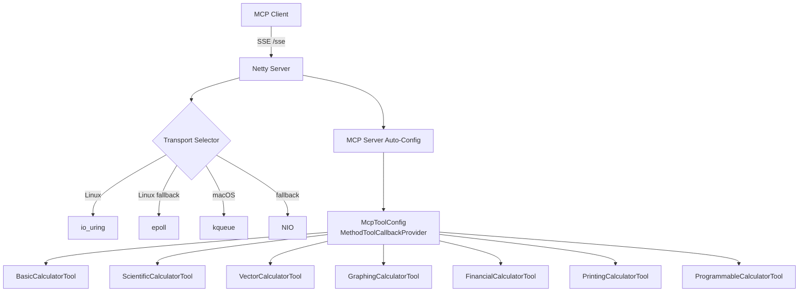

# Math Calculator — Spring AI MCP Server

A Spring Boot MCP (Model Context Protocol) server that exposes a math calculator via Spring AI. AI clients (Claude Desktop, Claude Code, Cursor, MCP Inspector) invoke calculator operations as MCP tools over SSE transport.

**Repository**: [https://github.com/farchanjo/math-calculator](https://github.com/farchanjo/math-calculator)

## Technology Stack

| Component    | Version   | Notes                                              |
|--------------|-----------|----------------------------------------------------|
| Java         | 25        | Virtual threads enabled                            |
| Spring Boot  | 4.0.3     | Released Feb 2026                                  |
| Spring AI    | 2.0.0-M2  | Milestone for Boot 4                               |
| Gradle       | Groovy DSL| `build.gradle`                                     |
| Server       | Netty     | WebFlux — io_uring/epoll/kqueue transport          |
| Transport    | SSE       | `spring-ai-starter-mcp-server-webflux`             |

## Build & Run

```bash
# Build
./gradlew build

# Run (port 44321)
./gradlew bootRun

# Tests only
./gradlew test
```

## MCP Tools Reference

### Basic Calculator (BigDecimal precision)

| Tool       | Params               | Description                                     |
|------------|----------------------|-------------------------------------------------|
| `add`      | `first`, `second`    | Add two numbers. Returns exact result.          |
| `subtract` | `first`, `second`    | Subtract second from first. Returns exact result.|
| `multiply` | `first`, `second`    | Multiply two numbers. Returns exact result.     |
| `divide`   | `first`, `second`    | Divide first by second. 20-digit precision.     |
| `power`    | `base`, `exponent`   | Raise base to exponent. Returns exact result.   |
| `modulo`   | `first`, `second`    | Compute remainder of first divided by second.   |
| `abs`      | `value`              | Compute absolute value of a number.             |

### Scientific Calculator (StrictMath)

| Tool        | Params    | Description                                     |
|-------------|-----------|------------------------------------------------ |
| `sqrt`      | `number`  | Compute square root of a number.                |
| `log`       | `number`  | Compute natural logarithm (ln) of a number.     |
| `log10`     | `number`  | Compute base-10 logarithm of a number.          |
| `factorial` | `num`     | Compute factorial (n!). Range: 0 to 20.         |
| `sin`       | `degrees` | Compute sine of an angle in degrees.            |
| `cos`       | `degrees` | Compute cosine of an angle in degrees.          |
| `tan`       | `degrees` | Compute tangent of an angle in degrees.         |

### Vector Calculator (SIMD — Java Vector API)

| Tool             | Params                  | Description                                      |
|------------------|-------------------------|--------------------------------------------------|
| `sumArray`       | `numbers`               | Sum all elements of a numeric array.             |
| `dotProduct`     | `first`, `second`       | Compute dot product of two numeric arrays.       |
| `scaleArray`     | `numbers`, `scalar`     | Multiply all array elements by a scalar.         |
| `magnitudeArray` | `numbers`               | Compute Euclidean norm (magnitude) of a vector.  |

### Graphing Calculator (Expression Engine)

| Tool            | Params                                           | Description                                        |
|-----------------|--------------------------------------------------|----------------------------------------------------|
| `plotFunction`  | `expression`, `variable`, `min`, `max`, `steps`  | Plot a function. Returns JSON array of {x, y} points.|
| `solveEquation` | `expression`, `variable`, `initialGuess`          | Solve f(x)=0 via Newton-Raphson. Returns root value.|
| `findRoots`     | `expression`, `variable`, `min`, `max`            | Find all real roots of f(x)=0 in an interval.      |

### Financial Calculator (BigDecimal precision)

| Tool                   | Params                                                  | Description                                       |
|------------------------|---------------------------------------------------------|---------------------------------------------------|
| `compoundInterest`     | `principal`, `annualRate`, `years`, `compoundsPerYear` (int) | Compute compound interest. Returns final amount.|
| `loanPayment`          | `principal`, `annualRate`, `years`                       | Compute fixed monthly loan payment.              |
| `presentValue`         | `futureValue`, `annualRate`, `years`                     | Compute present value of a future amount.        |
| `futureValueAnnuity`   | `payment`, `annualRate`, `years`                         | Compute future value of an ordinary annuity.     |
| `returnOnInvestment`   | `gain`, `cost`                                           | Compute ROI as a percentage.                     |
| `amortizationSchedule` | `principal`, `annualRate`, `years`                       | Generate monthly amortization schedule as JSON.  |

### Printing Calculator (Tape/Audit Trail)

| Tool               | Params       | Description                                              |
|--------------------|-------------|----------------------------------------------------------|
| `calculateWithTape`| `operations`| Tape calculator. Returns printed tape with running totals.|

### Programmable Calculator (Expression Engine)

| Tool                    | Params                      | Description                                                    |
|-------------------------|-----------------------------|----------------------------------------------------------------|
| `evaluate`              | `expression`                | Evaluate a math expression. Supports +,-,*,/,^,% and functions.|
| `evaluateWithVariables` | `expression`, `variables`   | Evaluate a math expression with variables.                     |

## Integration

### Claude Code

Add to your MCP configuration:

```json
{
  "mcpServers": {
    "math-calculator": {
      "url": "http://localhost:44321/sse"
    }
  }
}
```

### MCP Inspector

```bash
pnpm dlx @modelcontextprotocol/inspector
```

Connect to `http://localhost:44321/sse`.

## Design Principles

- **Precision**: `BigDecimal` for exact basic/financial arithmetic, `StrictMath` for reproducible scientific functions
- **SIMD**: Java 25 Vector API (`jdk.incubator.vector`) for hardware-accelerated batch array operations
- **Transport**: Netty with io_uring (Linux), epoll, kqueue (macOS), NIO fallback
- **Virtual threads**: `spring.threads.virtual.enabled=true` for lightweight concurrency

## Architecture


