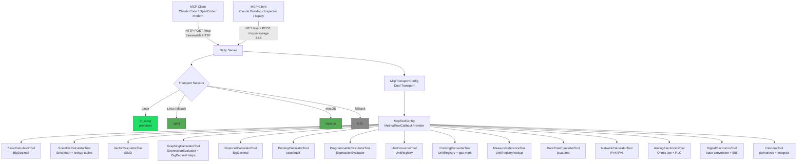
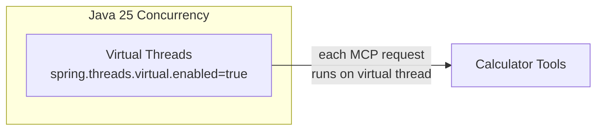
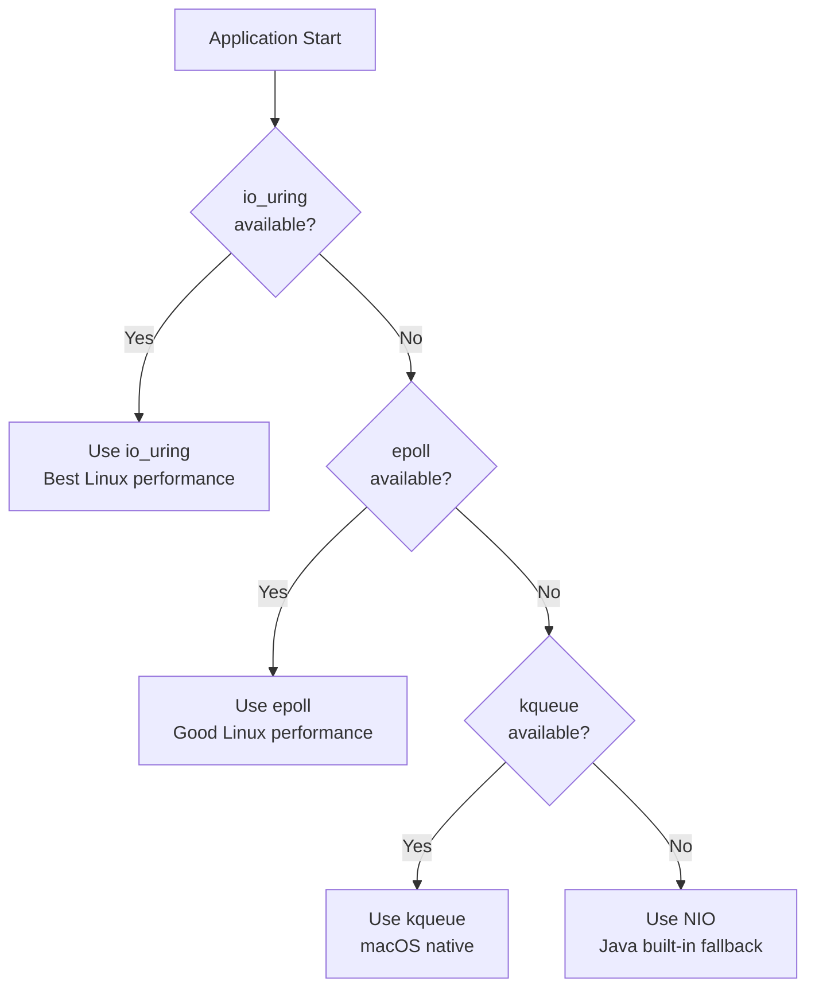
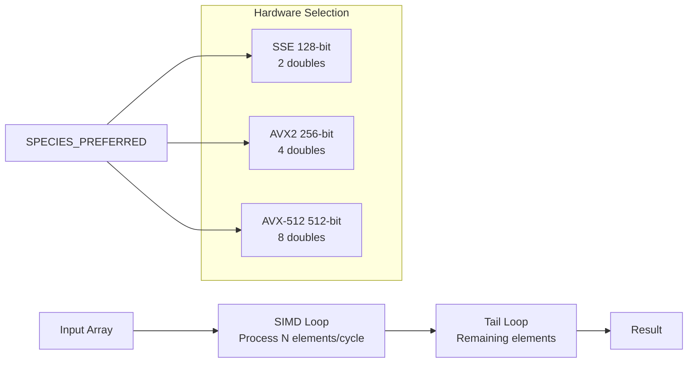
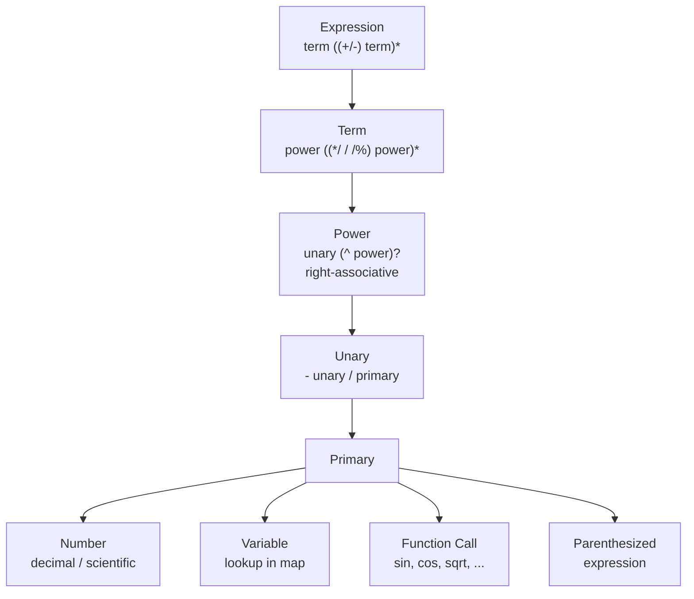
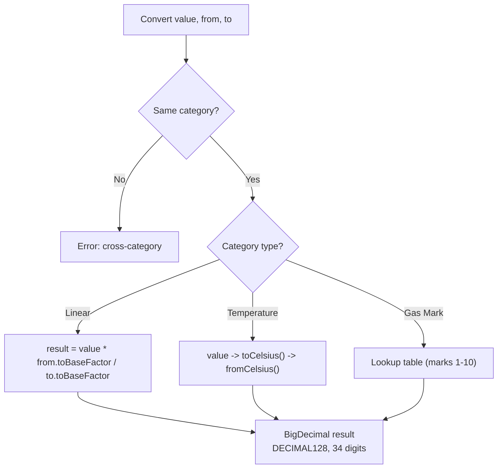
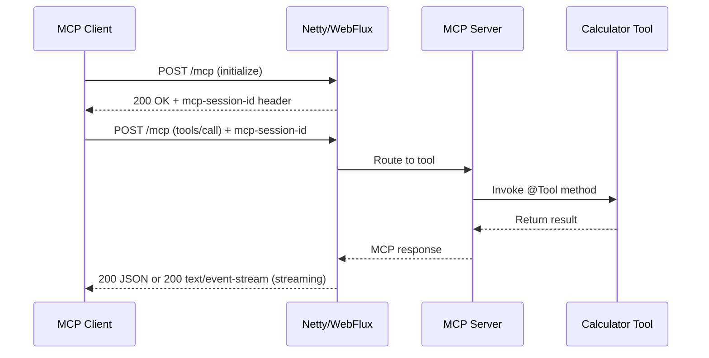
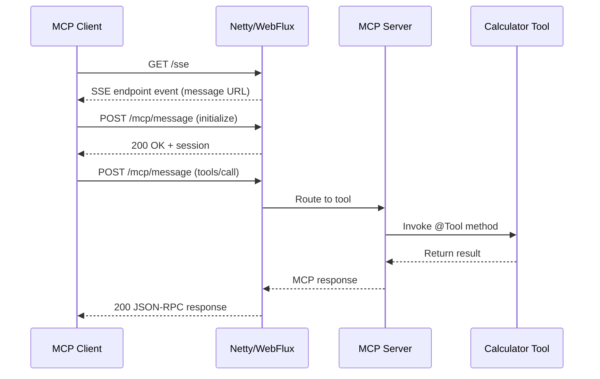
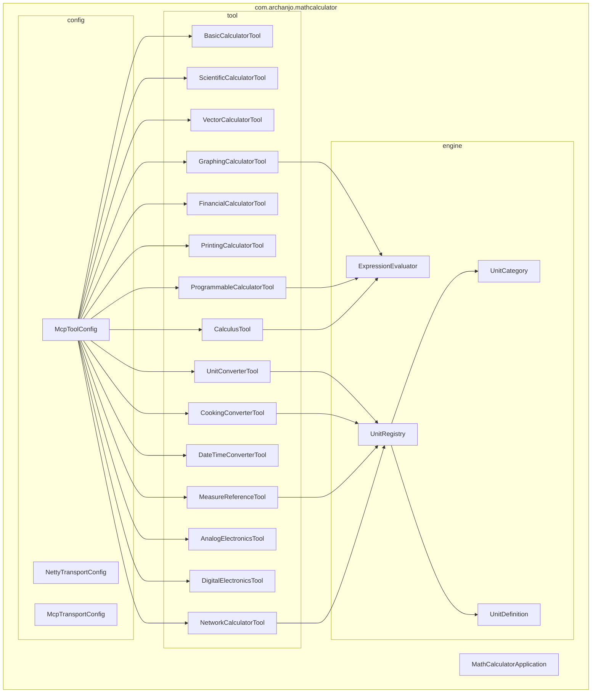

# Architecture

## System Overview

## Concurrency Model

## Transport Selection

The `NettyTransportConfig` selects the best available Netty transport at startup using reflection:

## SIMD Vector Operations

The `VectorCalculatorTool` uses the Java 25 Vector API (`jdk.incubator.vector`) for hardware-accelerated batch operations:

## Expression Engine

The `ExpressionEvaluator` is a recursive descent parser supporting:

## Unit Conversion Engine

The `UnitRegistry` is a static utility backed by `UnitCategory` (enum, 21 categories) and `UnitDefinition` (record, code + name + category + toBaseFactor):

## MCP Transport Flows

### Streamable HTTP (POST /mcp)

Used by Claude Code, OpenCode, and other modern MCP clients.

### SSE (GET /sse + POST /mcp/message)

Used by Claude Desktop, MCP Inspector, and legacy MCP clients.

## Package Structure

