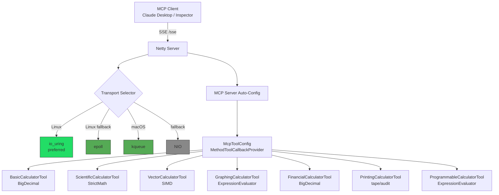
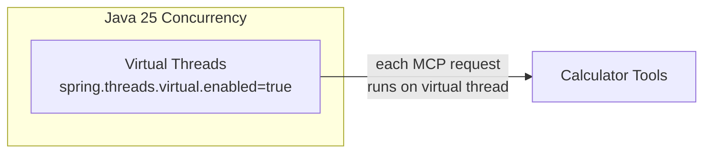
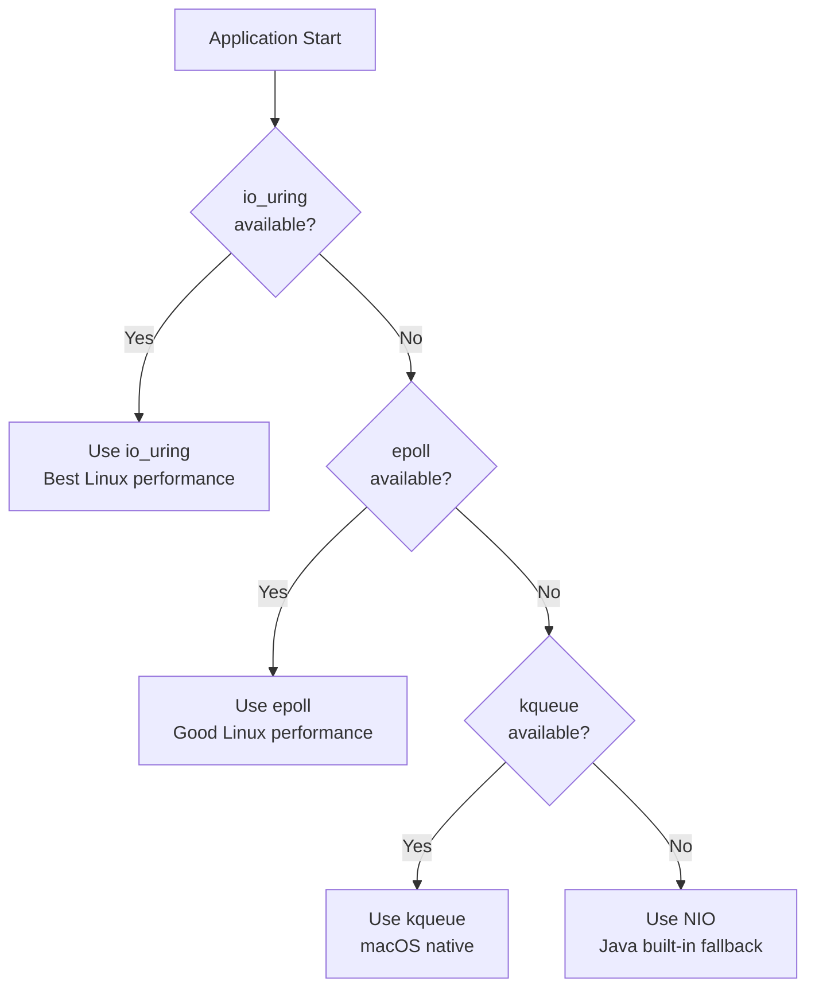
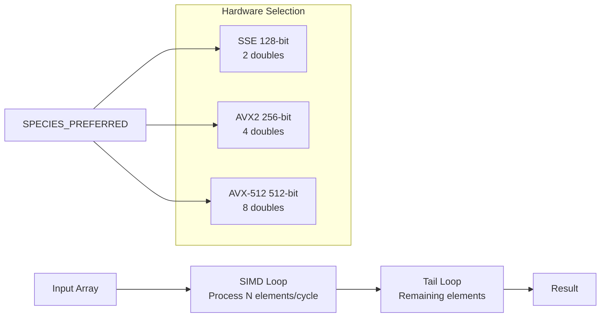
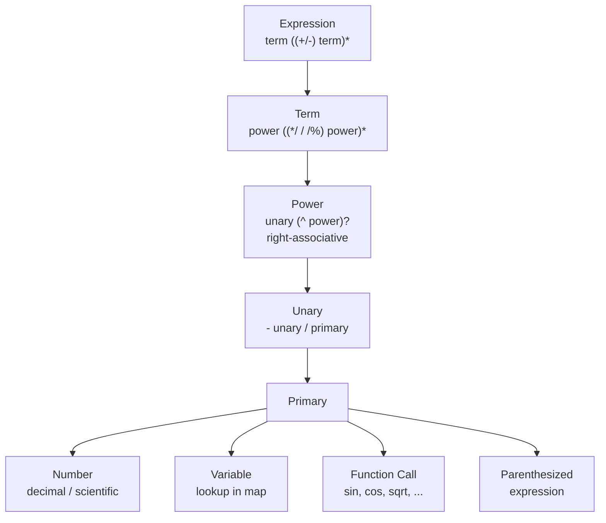
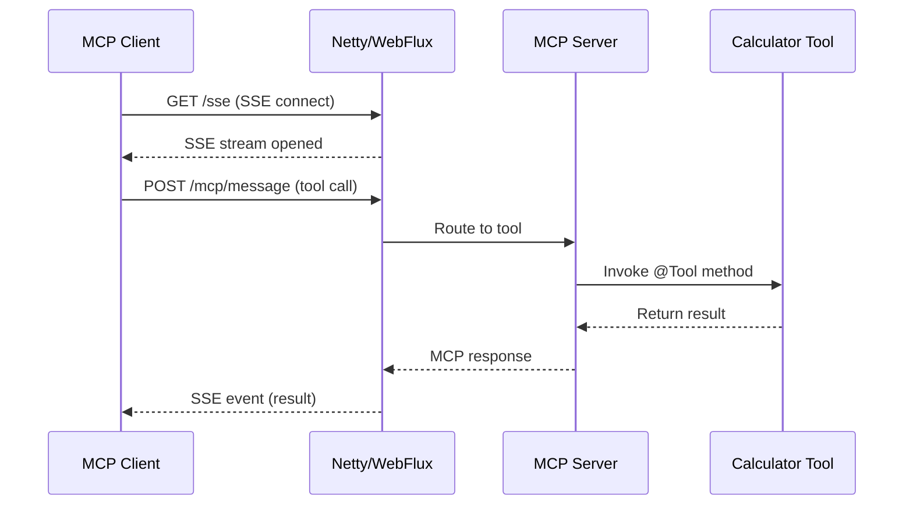
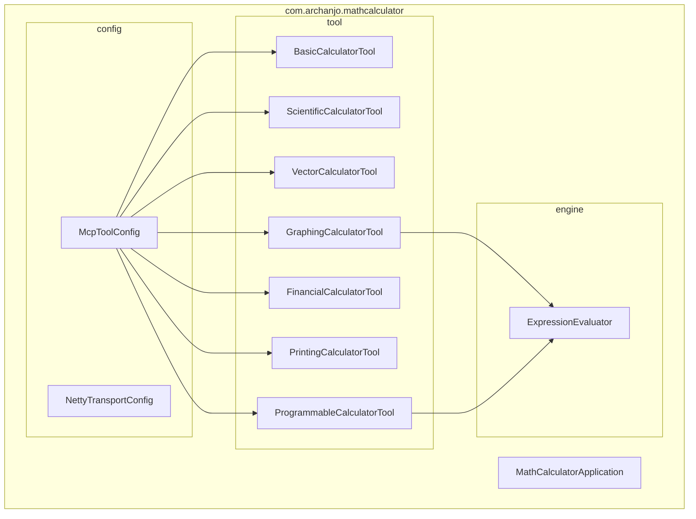

# Architecture

## System Overview

## Concurrency Model

## Transport Selection

The `NettyTransportConfig` selects the best available Netty transport at startup using reflection:

## SIMD Vector Operations

The `VectorCalculatorTool` uses the Java 25 Vector API (`jdk.incubator.vector`) for hardware-accelerated batch operations:

## Expression Engine

The `ExpressionEvaluator` is a recursive descent parser supporting:

## SSE Flow

## Package Structure

